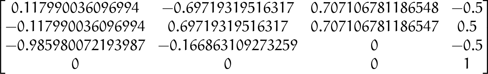

# Checkpoint 19 - Basic Arm Kinematics

ROS-powered **kinematic stack for a 3-DOF anthropomorphic arm** (waist roll + shoulder pitch + elbow pitch) built from first principles on the **Denavit-Hartenberg convention**. Two symbolic engines drive the project: a **SymPy** forward-kinematics pipeline that builds the per-joint `A_i` matrices, multiplies and simplifies them to produce the closed-form `A0_3` homogeneous transform, and a **closed-form inverse kinematics solver** that returns the **four elbow-up / elbow-down / waist-front / waist-back** branches via the law of cosines. The full stack — IK → joint commands → `/antropomorphic_arm` effort-controlled joints → Gazebo + TF → RViz markers — is demonstrated on a **time-varying ellipsoidal trajectory** that sweeps the end-effector workspace.

<p align="center">
  
</p>

## How It Works

<p align="center">
  
</p>

### Forward Kinematics — DH Pipeline (`generate_matrices.py`, `fk_antropomorphic_arm.py`)

1. `GenerateMatrices` builds a generic symbolic DH transform from `(θ_i, α_i, r_i, d_i)` using SymPy
2. For the 3-DOF anthropomorphic arm, the parameters are:

   | `i` | `α_i` | `r_i` | `d_i` | `θ_i` |
   |---|-------|------|-------|-------|
   | 1 | `π/2` | 0    | 0     | `θ_1` (waist)   |
   | 2 | 0     | `r_2` | 0    | `θ_2` (shoulder) |
   | 3 | 0     | `r_3` | 0    | `θ_3` (elbow)    |
3. Each `A_i` is substituted from the generic DH, multiplied left-to-right to yield `A0_3`, and simplified via `trigsimp`
4. `FKAntropomorphicArm.compute(θ_1, θ_2, θ_3)` returns position, orientation and the full `A0_3` matrix, then optionally renders it to `A03_simplify_evaluated.png` via `sympy.preview`

### Inverse Kinematics — 4 Closed-Form Branches (`ik_antropomorphic_arm.py`)

Given a target `(P_ee_x, P_ee_y, P_ee_z)` with link lengths `r_2 = r_3 = 1.0`:

1. `d_xy = hypot(P_ee_x, P_ee_y)`; reach check `|C_3| = |(D² − r_2² − r_3²) / (2·r_2·r_3)| ≤ 1`, otherwise target out of reach
2. Common angles: `φ = atan2(P_ee_z, d_xy)`, `θ_1_base = atan2(P_ee_y, P_ee_x)`, `θ_1_flip = θ_1_base − π`
3. Enumerate four branches — `config ∈ {plus, minus}` × `sign_3 ∈ {+1, −1}`:
   - `S_3 = sign_3 · √(1 − C_3²)` → `θ_3 = atan2(S_3, C_3)`
   - Shoulder auxiliary `δ_2 = atan2(|r_3·S_3|, r_2 + r_3·C_3)`
   - `"plus"` → `θ_2 = φ − sign_3·δ_2`, `θ_1 = θ_1_base`
   - `"minus"` → `θ_2 = π − (φ + sign_3·δ_2)` normalized, `θ_1 = θ_1_flip`
4. Each branch is validated against joint limits `θ_2 ∈ [-π/4, 3π/4]`, `θ_3 ∈ [-3π/4, 3π/4]`; unreachable branches still returned with `possible = False`
5. The returned list is ordered `[elbow-down × 2, elbow-up × 2]` so the consumer can pick via an `elbow_policy` string (`"up"` / `"down"`)

### Joint Command + RViz Marker Pipeline (`move_joints.py`, `rviz_marker.py`, `antropomorphic_end_effector_mover.py`)

1. `JointMover` publishes `std_msgs/Float64` on:
   - `/antropomorphic_arm/joint1_position_controller/command`
   - `/antropomorphic_arm/joint2_position_controller/command`
   - `/antropomorphic_arm/joint3_position_controller/command`
2. `MarkerBasics` publishes blue-then-random-colored `visualization_msgs/Marker` spheres on `/ee_position` at each commanded goal — visible in RViz under `frame_0`
3. `AntropomorphicEndEffectorMover` ties the stack together:
   - Subscribes `/ee_pose_commands` (`planar_3dof_control/EndEffector`: `geometry_msgs/Vector3 ee_xy_theta` + `std_msgs/String elbow_policy`)
   - Calls `IKAntropomorphicArm.calculate_ik(x, y, z)`, picks branches `0:2` for `"down"` or `2:4` for `"up"`, prefers the first within joint limits, falls back to the first raw solution otherwise
   - Commands the joints and publishes an RViz marker at the target

### Ellipsoidal Motion Generator (`ellipsoidal_motion.py`)

- Publishes `EndEffector` on `/ee_pose_commands` at 20 Hz
- Parametric `(x, y) = (a·cos θ, b·sin θ)` with `θ` advancing in `Δ = 0.03` rad steps
- On each full revolution (`θ ≥ 2π`):
  - Height `z` moves in `±0.1 m` steps between `[-0.5, 0.5]`
  - Semi-axes `a, b` contract (up flag) / expand (down flag) in `0.1 m` steps, clamped to `[0.8, 1.7]`
- Default elbow policy: `"plus-minus"` (the mover falls back through branches if none match)

## Tasks Breakdown

### Task 1 — Symbolic DH Forward Kinematics

- `generate_matrices.py` builds the generic DH matrix and produces the individual `A0_1`, `A1_2`, `A2_3` and composite `A0_3` / `A0_3_simplified` as PNG previews
- `fk_antropomorphic_arm.py` exposes `FKAntropomorphicArm.compute(θ_1, θ_2, θ_3)` for numerical evaluation and writes `A03_simplify_evaluated.png` for any concrete joint triplet

### Task 2 — Closed-Form Inverse Kinematics

- `ik_antropomorphic_arm.py` returns 4 `(θ_1, θ_2, θ_3, possible)` branches per target
- Joint limits applied to `θ_2` / `θ_3` flag each branch as `possible = True/False`
- `interactive()` lets the operator type a target and inspect all four solutions from the terminal

### Task 3 — Joint Commanding + Custom Message

- `planar_3dof_control/msg/EndEffector.msg` — custom message `geometry_msgs/Vector3 ee_xy_theta + std_msgs/String elbow_policy`
- `JointMover` publishes joint setpoints to the three effort-controlled joints (PID gains `{p: 1000, i: 0.05, d: 50}`)
- `MarkerBasics` publishes a `visualization_msgs/Marker` sphere per target

### Task 4 — Full Ellipsoidal Pipeline

- `start_ellipsoidal_motion.launch` co-launches `ellipsoidal_motion_node` + `antropomorphic_end_effector_mover_node`
- The arm traces nested ellipses of varying `(a, b, z)` through the reachable workspace — visible simultaneously in Gazebo (arm) and RViz (colored sphere trail of targets)

## ROS Interface

| Name | Type | Description |
|---|---|---|
| `/ee_pose_commands` | `planar_3dof_control/EndEffector` (pub/sub) | Commanded end-effector pose + elbow policy |
| `/end_effector_real_pose` | `geometry_msgs/Vector3` (sub) | Real pose from the TF listener, logged by the mover |
| `/ee_position` | `visualization_msgs/Marker` (pub) | RViz sphere at each commanded target |
| `/antropomorphic_arm/joint1_position_controller/command` | `std_msgs/Float64` (pub) | Joint 1 (waist) setpoint |
| `/antropomorphic_arm/joint2_position_controller/command` | `std_msgs/Float64` (pub) | Joint 2 (shoulder) setpoint |
| `/antropomorphic_arm/joint3_position_controller/command` | `std_msgs/Float64` (pub) | Joint 3 (elbow) setpoint |
| `/antropomorphic_arm/joint_states` | `sensor_msgs/JointState` | Joint state publisher output |
| TF: `frame_0 → … → end_effector_link` | TF tree | Full arm chain from Gazebo |

## Project Structure

```
antropomorphic_project/                 # This package (the checkpoint deliverable)
├── src/antropomorphic_project/
│   ├── generate_matrices.py            # SymPy DH pipeline (Task 1 infrastructure)
│   ├── fk_antropomorphic_arm.py        # FK evaluation + matrix preview
│   ├── ik_antropomorphic_arm.py        # 4-branch closed-form IK
│   ├── move_joints.py                  # JointMover → /antropomorphic_arm/jointN/command
│   └── rviz_marker.py                  # MarkerBasics → /ee_position
├── scripts/
│   ├── antropomorphic_end_effector_mover.py  # IK + move + marker glue node
│   └── ellipsoidal_motion.py                 # Task 4 trajectory publisher
├── launch/start_ellipsoidal_motion.launch    # Task 4 entry point
├── media/
├── CMakeLists.txt
└── package.xml

../planar_3dof_control/                # Sibling package providing EndEffector.msg + controllers
└── msg/EndEffector.msg                # geometry_msgs/Vector3 ee_xy_theta + std_msgs/String elbow_policy

# simulation_ws/src/planar_3dof_kinematics/    (separate workspace)
├── antropomorphic_arm_description/    # URDF/xacro + meshes + rviz config
├── antropomorphic_arm_control/        # effort_controllers YAML + spawner + TF listener
└── antropomorphic_arm_gazebo/         # Gazebo world + spawn.launch + main.launch
```

## How to Use

### Prerequisites

- ROS Noetic (rospy, roslaunch)
- Gazebo (classic) + `gazebo_ros_pkgs`, `ros_control`, `effort_controllers`, `joint_state_controller`, `robot_state_publisher`
- Python 3 with `sympy` (symbolic FK) and `numpy`

### Build

```bash
# Simulation workspace (description + gazebo + control)
cd ~/simulation_ws
catkin_make
source devel/setup.bash

# Project workspace (IK/FK/mover + planar_3dof_control message)
cd ~/catkin_ws
catkin_make
source devel/setup.bash
```

### Explore the symbolic DH pipeline (no robot required)

```bash
# Generate generic + arm-specific A matrices as PNGs
rosrun antropomorphic_project generate_matrices.py

# Evaluate FK for a concrete joint triplet — writes A03_simplify_evaluated.png
rosrun antropomorphic_project fk_antropomorphic_arm.py
```

### Check IK interactively

```bash
rosrun antropomorphic_project ik_antropomorphic_arm.py
# Enter Pee_x / Pee_y / Pee_z — prints all four branches with feasibility flags
```

### Simulation — Task 4 (full ellipsoidal pipeline)

```bash
# Terminal 1 — Gazebo + arm + effort controllers + TF listener
roslaunch antropomorphic_arm_gazebo main.launch

# Terminal 2 — RViz (loaded via arm description)
rosrun rviz rviz -d $(rospack find antropomorphic_arm_description)/rviz/arm_view.rviz

# Terminal 3 — ellipsoidal trajectory + IK/mover
roslaunch antropomorphic_project start_ellipsoidal_motion.launch
```

### Sanity checks

```bash
# Commanded EE targets
rostopic echo /ee_pose_commands

# Real EE pose extracted from TF
rostopic echo /end_effector_real_pose

# Joint states
rostopic echo /antropomorphic_arm/joint_states

# RViz markers
rostopic echo /ee_position
```

## Key Concepts Covered

- **Denavit-Hartenberg convention**: `(θ, α, r, d)` parameter table, standard DH homogeneous transform `A_i`, chained `A0_n = A0_1 · A1_2 · … · A(n-1)_n`
- **Symbolic computation with SymPy**: `trigsimp`, `simplify`, `subs`, `Matrix`, `preview` to export math to PNG/DVI
- **Closed-form inverse kinematics**: law of cosines on the shoulder-elbow triangle, waist decomposition via `atan2`, four-branch enumeration (elbow up/down × waist front/back)
- **Joint-limit feasibility gating** — returning all branches with a `possible` flag so downstream policies can pick
- **ROS Gazebo control stack**: `effort_controllers/JointPositionController` × 3 + `joint_state_controller` + `robot_state_publisher`
- **Custom messages**: `planar_3dof_control/EndEffector` compositing a pose vector with an elbow-policy string
- **TF → real end-effector pose**: separate TF listener republishes on `/end_effector_real_pose` for closed-loop inspection
- **RViz markers**: `visualization_msgs/Marker` as a lightweight trail visualization for commanded targets
- **Parametric workspace exploration**: ellipsoidal trajectory generator with layered `(a, b, z)` scheduling

## Technologies

- ROS Noetic (rospy, roslaunch, `tf`)
- SymPy (symbolic DH pipeline)
- NumPy
- Gazebo Classic + `ros_control` (`effort_controllers`, `joint_state_controller`)
- Python 3
